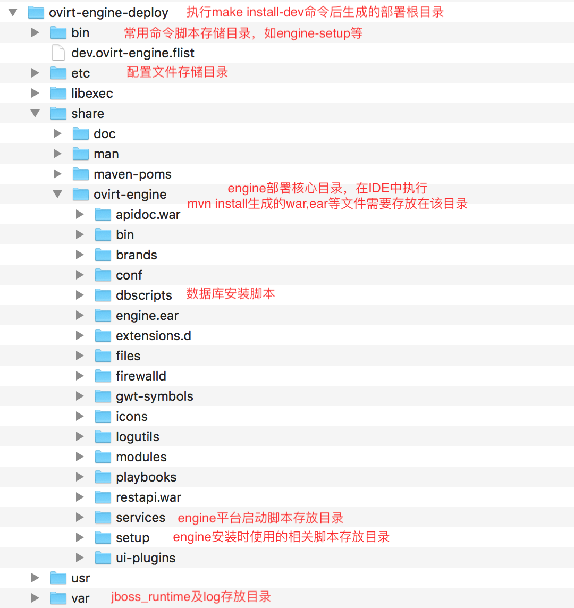

# 中文
---
> 提示：为了能比较顺畅的阅读本文档，您需要具体基本的docker基础知识及常用命令的使用。如果您尚未听说过docker，则请先通过[docker官方文档][5]学习必要的知识。

# 1. 快速入门
制作本镜像的主要目的：快速创建并启动一个近似于本地的ovirt-engine容器，它可以为有需要的开发人员（特别是基于windows平台）提供近似于本地的开发、测试、调试环境。

## 1.1. 先决条件
* 安装Docker运行环境，docker分企业版与社区版，我们只需要社区版即可，具体可参考[Docker官网文档][1]。

> 由于Windwos系统的特殊性，建议在Windows-10专业版或企业版（64位）系统上安装[Docker for windows][2]（直接基于Windows Hyper-V）;
> 而之前的Windows版本则需要使用[Docker Toolbox on Windows][4]（需要借助Oracle Virtual Box）。
> **在Windwos上激活Hyper-V意味着无法同时运行Virtual Box与VMWare workstation等其他虚拟化平台**

## 1.2. 构建ovirt-engine镜像
> 如果您想自己定制一个新镜像，您才需要使用本节介绍的内容。正常情况下，您可以忽略本节内容。

```
# 假设工作目录为：~/workspace/Dockerfiles，要创建的镜像名为：simiam/ovirt-engine-dev
cd ~/workspace/Dockerfiles/ovirt-engine
docker build -t simiam/ovirt-engine-dev ./latest
```

## 1.3. 创建ovirt-engine-dev容器
> 想快速搭建一个ovirt-engine开发调试环境的话，从这一节开始看起。

基于`simiam/ovirt-engine-dev`镜像创建一个名为`ovirt-engine-dev`的容器，容器的主机名为`ovirt-engine-dev`。

* 删除容器：如果之前有创建过同名的容器，则需要先停止并删除容器
```
# Stop and remove 'ovirt-engine-dev' docker container IF necessary.
docker stop ovirt-engine-dev && docker rm ovirt-engine-dev
```

* 创建容器：当前提供的母镜像要求容器的主机名必需为：`ovirt-engine-dev`，后续会提供可配置的环境变量
```
# The container's hostname MUST BE 'ovirt-engine-dev'
docker run -d -i -t --name ovirt-engine-dev -h ovirt-engine-dev --privileged \
-v /env/.m2/:/env/.m2 -v ~/env/ovirt-engine:/env/workspace -v /env/ovirt-engine-deploy:/env/deploy \
-p 10022:22 -p 5432:5432 -p 8080:8080 -p 8787:8787 -p 8443:8443 /
simiam/ovirt-engine-dev /usr/sbin/init

```
```
# 参数详细说明如下：
docker run -d -i -t        # 通用参数，参考官网
--name ovirt-engine-dev    # 容器名
-h ovirt-engine-dev        # 容器中OS系统的hostname，如果使用默认的部署环境，则主机名必须为:ovirt-engine-dev
--privileged               # 配合/usr/sbin/init参数，以开启特权模式（使systemctl可用）
-v /env/.m2/:/env/.m2      # maven本地仓库映射关系
-v ~/env/ovirt-engine:/env/workspace       # 源码工程根目录映射关系，前者代表宿主机目录，即本地目录（下同）
-v /env/ovirt-engine-deploy:/env/deploy    # 打包部署根目录映射关系
-p 10022:22                # SSH端口映射关系，10022为宿主机端口
-p 5432:5432               # Postgres数据库端口映射关系 
-p 8080:8080               # ovirt-engine webadmin HTTP服务端口映射关系
-p 8787:8787               # 远程调试端口映射关系 
-p 8443:8443               # ovirt-engine webadmin HTTPS服务端口映射关系（目录不可用）
simiam/ovirt-engine-dev    # 镜像名
/usr/sbin/init             # 容器启动时需要执行命令，与privileged配合使用
```

* 端口映射相关信息
| 服务名 | 容器内部端口 | 宿主机端口 |
| ----- | ----- | ----- |
|SSH|22|10022|
|Postgresql|5432|5432|
|HTTP|8080|8080|
|HTTPS|8443|8443|
|远程调试|8787|8787|

> 容器内部端口目前是固定的，不支持根据环境变量来动态配置；宿主机端口则可根据个人喜好来配置。


## 1.4. ovirt-engine-dev容器生命周期管理
* 停止容器：`docker stop ovirt-engine-dev`
* 启动容器：`docker start ovirt-engine-dev`
* 重启容器：`docker restart ovirt-engine-dev`

## 1.5. 启动容器中的ovirt-engine服务
```
docker exec -it -u ssh_ovirt ovirt-engine-dev /env/start-engine-service.sh
```

## 1.6. 使用ovirt-engine
1. 容器操作系统用户与密码：
* root:engine
* ssh_ovirt:ssh_ovirt

2. Postgresql数据库相关信息
* 数据库名：engine
* 数据库端口：5432
* engine用户的密码：engine
* postgres用户的密码：postgres

3. 访问地址虚拟化管理平台系统：http://localhost:8080，用户名密码：admin/engine

4. 登录ovirt-engine所在的OS，有2种方式
* 使用SSH：`ssh -p <映射端口号> ssh_ovirt@localhost`，其中映射端口号为1.3节创建容器实例命令`docker run ...`中与容器内`22`号端口映射的`宿主机`端口号，如示例中的`10022`；SSH用户`ssh_ovirt`的密码：`ssh_ovirt`，`root`用户的密码：`engine`。 -- **推荐**
* 使用docker命令：`docker exec -it <容器名> /bin/bash`

## 1.7. ovirt-engine部署目录介绍
ovirt-engine平台部署在wildfly(jboss)服务器上，但其并不是采用wildfly官方所描述的标准部署方式及部署结构，其使用一套自己的部署目录结构，如下：



这些目录与`wildfly`环境的关联关系
```
-Djboss.home.dir=/usr/share/ovirt-engine-wildfly 
-Djboss.server.base.dir=/env/ovirt-engine-deploy/share/ovirt-engine 
-Djboss.server.data.dir=/env/ovirt-engine-deploy/var/lib/ovirt-engine 
-Djboss.server.log.dir=/env/ovirt-engine-deploy/var/log/ovirt-engine 
-Djboss.server.config.dir=/env/ovirt-engine-deploy/var/lib/ovirt-engine/jboss_runtime/config 
-Djboss.server.temp.dir=/env/ovirt-engine-deploy/var/lib/ovirt-engine/jboss_runtime/tmp 
-Djboss.controller.temp.dir=/env/ovirt-engine-deploy/var/lib/ovirt-engine/jboss_runtime/tmp
```

# 2. ovirt-engine本地开发调试环境搭建
> 工作目录统一用`$WORK_DIR`表示

经过第1章节的介绍，相信您已经可以在本地使用ovirt-engine平台。本章节将介绍如何基于ovirt-engine容器进行本地开发与调试。

从零开始搭建ovirt-engine环境到部署成功（可以访问web）共包括4个步骤：编译 -> 打包(部署) -> 初始化 -> 启动，各个步骤使用的命令如下：
* 编译 + 打包(部署)：在源码根目录下执行`make clean install-dev PREFIX=/env/deploy BUILD_UT=0 DEV_EXTRA_BUILD_FLAGS="-Dgwt.compiler.localWorkers=1 -Djava.net.preferIPv4Stack=true"`，就可以生成类似1.7节介绍的部署目录结构及相关内容。
* 初始化：`/env/deploy/bin/engine-setup`，初始化内容主要是配置ovirt-engine系统主要参数，执行数据库创建脚本等
* 启动：`/env/deploy/share/ovirt-engine/services/ovirt-engine/ovirt-engine.py start`，该命令是用来启动`wildfly(jboss)`服务器，从而启动ovirt-engine管理平台。

**注意：以上三个命令都需要在docker容器内执行。**其中，编译webadmin阶段会消耗大量内存，建议宿主机内存至少为8G（推荐12G）。

## 2.1. 准备源码及开发环境
* 从ovirt-engine的github源码仓库获取一份源码至本地工作目录：`git clone https://github.com/ovirt/ovirt-engine.git`
* 使用您熟悉的IDE将ovirt-engine项目导入您的IDE中

## 2.2. ovirt-engine源码构建
* ovirt-engine项目核心源码使用maven作为构建工具，因此可以使用`mvn clean install`构建出相应的war，ear等部署文件。

> 这一步是我们日常开发过程中经常使用到的：
> 一般情况下我们需要将生成的相关部署文件通过jboss-cli或jboss-web重新部署，或直接将变更文件覆盖部署目录下的相应文件并重启服务。

## 2.3. ovirt-engine打包(部署)
在2.2节中使用的`mvn clean install`只能在工程的`target`目录下产生相关的jar，war,ear等文件，并不会生成目录结构及其下的相关内容。

为了完成部署需要在docker环境下使用`make install-dev ...`命令进行一次完整的构建、部署。

因为这一步耗时比较长，因为基于`simiam/ovirt-engine-dev`镜像创建的容器已经事先替您执行了一次打包部署，所以一般情况下您不需要执行这一步操作，除非发生了以下几种情况：
* 打包、部署、安装相关的代码变更
* 您想定制ovirt-engine：修改部署根目录、修改默认的环境变更等

## 2.4. ovirt-engine初始化
初始化内容主要是配置ovirt-engine系统主要参数，执行数据库创建脚本等。因此如果你想重新构建数据库、修改配置参数等，则可以执行初始化命令。

# 3. 其它
## 3.1. ovirt-engine容器创建参数介绍
本节将详细介绍创建一个ovirt-engine容器实例所指定的各参数。
```
docker run -d -i -t        # 通用参数，参考官网
--name ovirt-engine-dev    # 容器名
-h ovirt-engine-dev        # 容器中OS系统的hostname，如果使用默认的部署环境，则主机名必须为:ovirt-engine-dev
--privileged               # 配合/usr/sbin/init参数，以开启特权模式（使systemctl可用）
-v /env/.m2/:/env/.m2      # maven本地仓库映射关系
-v ~/env/ovirt-engine:/env/workspace       # 源码工程根目录映射关系，前者代表宿主机目录，即本地目录（下同）
-v /env/ovirt-engine-deploy:/env/deploy    # 打包部署根目录映射关系
-p 10022:22                # SSH端口映射关系，10022为宿主机端口
-p 5432:5432               # Postgres数据库端口映射关系 
-p 8080:8080               # ovirt-engine webadmin HTTP服务端口映射关系
-p 8787:8787               # 远程调试端口映射关系 
-p 8443:8443               # ovirt-engine webadmin HTTPS服务端口映射关系（目录不可用）
simiam/ovirt-engine-dev    # 镜像名
/usr/sbin/init             # 容器启动时需要执行命令，与privileged配合使用
```

## 3.2. 可用的快捷脚本模板
* init-engine-environment.sh  --> 使用默认的部署版本创建名为ovirt-engine-dev容器
* start-engine-service.sh  --> 启动ovirt-engine服务

---

# English
---
## Prerequisites
Just install the Docker CE that fit for your OS.

> In order install [Docker for windows][2]（Based Windows Hyper-V）, it requires Microsoft Windows 10 Professional or Enterprise 64-bit. 
> For previous versions get [Docker Toolbox on Windows][4]（Based Oracle Virtual Box）.

## Build docker-ovirt-engine
```
cd <repository_root_dir>
docker build -t simiam/ovirt-engine-dev ./latest
```

## Create ovirt-engine-dev docker container
```
# Stop and remove 'ovirt-engine-dev' docker container IF necessary.
docker stop ovirt-engine-dev && docker rm ovirt-engine-dev

# The container's hostname MUST BE 'ovirt-engine-dev'
docker run -d -i -t --name ovirt-engine-dev -h ovirt-engine-dev --privileged \
-v /env/.m2/:/env/.m2 -v ~/workspace/cloudos/ovirt/ovirt-engine:/env/workspace -v /env/ovirt-engine-deploy:/env/deploy \
-p 10022:22 -p 5432:5432 -p 8080:8080 -p 8787:8787 -p 8443:8443 /
simiam/ovirt-engine-dev /usr/sbin/init

```

## Startup exist 'ovirt-engine-dev' docker container and ovirt-engine service
```
docker start ovirt-engine-dev

docker exec -it -u ssh_ovirt ovirt-engine-dev /env/start-engine-service.sh
```

## Default user informations
* ovirt-engine-webadmin: admin/engine
* local-postgresql-db-port-user-password: engine-5432-engine-engine


[1]: https://docs.docker.com/install/linux/docker-ce/centos/
[2]: https://docs.docker.com/docker-for-windows/install/
[3]: https://store.docker.com/editions/community/docker-ce-desktop-windows
[4]: https://docs.docker.com/toolbox/toolbox_install_windows/
[5]: https://docs.docker.com/

